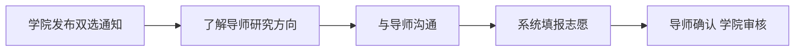

# 导师双选

入学后要进行导师双向选择。具体的时间安排、选导系统和名额分配，以学院现行通知为准，填在下方待填写项里。

## 一般流程

```mermaid
flowchart LR
    A[学院发布双选通知] --> B[了解导师研究方向]
    B --> C[与导师沟通]
    C --> D[系统填报志愿]
    D --> E[导师确认 学院审核]
```

## 提醒

- 留意学院发布的双选通知，别错过时间。
- 选导前先了解导师的研究方向和招生名额，主动沟通。

## 需要你填写

- 选导系统入口：【　】
- 双选时间安排：【　】
- 名额分配与双向选择细则：【　】
- 考核方式：【　】
