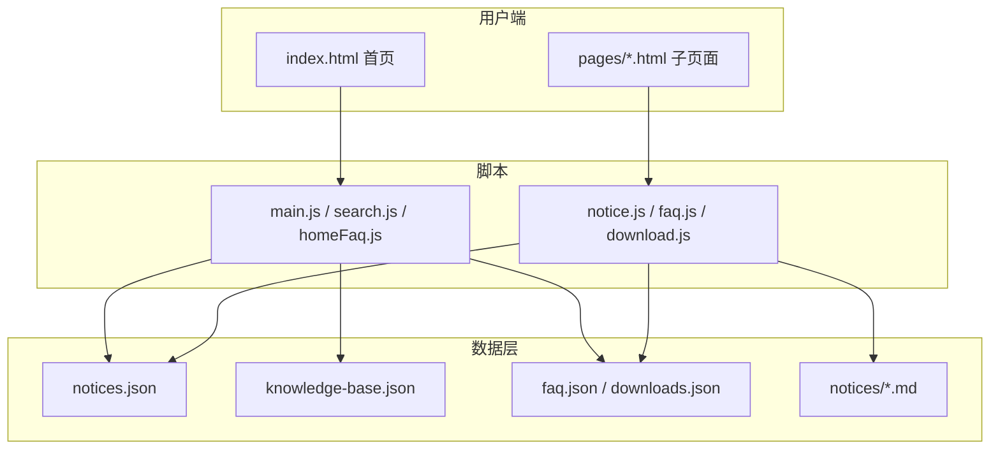

# 工学院研究生事务服务中心

## 首页

- 最新通知
- 常用入口
- 快速搜索

---

## 办事大厅

### 请假申请

### 外出报备

### 导师变更

### 证明开具

---

## 文件下载

### 请假模板

### 学术活动模板

### 毕业材料

---

## 奖助评优

### 国家奖学金

### 学业奖学金

### 三助岗位

---

## 学术活动

### 讲座通知

### 活动认定

---

## 竞赛专区

### 电赛

### 挑战杯

### 创新创业

---

## 毕业专区

### 学位申请

### 毕业登记表

### 离校手续

---

## FAQ

### 常见问题

---

## 意见反馈


```
━━━━━━━━━━━━━━━━━━

工学部研究生服务中心

研究生事务一站式服务平台

[搜索框]

━━━━━━━━━━━━━━━━━━

📝 请假申请
查看请假流程与模板

📂 文件下载
下载常用材料

🎓 奖助评优
奖学金与评优政策

📚 学术活动
讲座与认定

🎓 毕业专区
毕业与学位申请

❓ 常见问题
FAQ

━━━━━━━━━━━━━━━━━━

最新通知

━━━━━━━━━━━━━━━━━━
```

反馈接入问卷星


点击量


评论留言


日夜间不能保持


增加右侧浮动按钮  一键顶部

手机端


# 工学部研究生事务服务中心 — 项目分析报告

基于对仓库全部 30 个文件的阅读，以下是面向辅导员视角的结构与现状说明。

---

## 1. 项目目录结构说明

这是一个**纯静态网站**（HTML + CSS + JavaScript + JSON 数据），无后端、无构建工具，适合部署到 **GitHub Pages** 或任意静态托管服务。内容维护以改 JSON / Markdown 为主，无需写代码。

```
graduate-service-center/
├── index.html                 # 网站首页（入口）
├── 网站规划.md                 # 产品功能规划（非代码）
├── .gitignore                 # Git 忽略规则
│
├── assets/                    # 前端静态资源
│   ├── css/
│   │   ├── style.css          # 全局样式、深色模式、布局
│   │   └── components.css     # 组件样式（卡片、搜索、通知、FAQ 等）
│   │   └── home.css           # ⚠ 首页引用但文件不存在
│   └── js/
│       ├── main.js            # 主题切换 + 首页通知加载
│       ├── search.js          # 首页全局搜索
│       ├── homeFaq.js         # 首页「热门问题」预览
│       ├── faq.js             # FAQ 页数据渲染
│       ├── download.js        # 下载中心数据渲染
│       ├── notice.js          # 通知详情 + Markdown 解析
│       └── search-old.js      # 旧版搜索（已废弃，未引用）
│
├── pages/                     # 各业务子页面
│   ├── leave.html             # 请假申请
│   ├── download.html          # 文件下载
│   ├── faq.html               # 常见问题
│   ├── notice.html            # 通知详情
│   ├── scholarship.html       # 奖助评优
│   ├── freshman.html          # 新生专区
│   ├── graduation.html        # 毕业专区 ⚠ 结构不完整
│   └── academic.html          # 学术活动 ⚠ 几乎为空
│
├── data/                      # 内容数据（辅导员主要维护区）
│   ├── notices.json           # 通知索引
│   ├── knowledge-base.json    # 搜索知识库
│   ├── faq.json               # 通用 FAQ
│   ├── graduation-faq.json    # 毕业 FAQ（已准备，未接入页面）
│   ├── freshman-faq.json      # 新生 FAQ（已准备，未接入页面）
│   ├── downloads.json         # 下载文件清单
│   ├── stats.json             # 统计数据（已准备，未接入页面）
│   └── search-index.json      # 旧搜索索引（未使用）
│
├── notices/                   # 长通知 Markdown 正文
│   └── 2026001.md             # 示例：国家奖学金评选通知
│
├── docs/
│   └── maintenance-guide.md   # 维护操作手册（给辅导员用）
│
└── files/                     # ⚠ 规划中，目录及实际文件均不存在
```

**技术架构概览：**



---

## 2. 各文件作用

### 根目录

| 文件 | 作用 |
|------|------|
| `index.html` | 首页：搜索框、7 个功能入口、最新通知、热门问题、热门服务、办事指南、数据中心、意见反馈 |
| `网站规划.md` | 功能蓝图与待办（办事大厅、竞赛专区、问卷星反馈、一键回顶等） |
| `.gitignore` | 排除编辑器配置、系统临时文件、`node_modules` |

### `assets/css/`

| 文件 | 作用 |
|------|------|
| `style.css` | CSS 变量、深色/浅色主题、导航栏、Hero、搜索框、功能卡片、统计区、页脚、基础移动端适配 |
| `components.css` | 子页面通用组件、搜索联想框、通知/FAQ/下载卡片、热门服务、办事指南、反馈区、毕业时间线样式 |

### `assets/js/`

| 文件 | 作用 |
|------|------|
| `main.js` | 深色模式切换；从 `notices.json` 动态渲染首页通知，点击跳转详情并上报 GA |
| `search.js` | 读取 `knowledge-base.json`，实现关键词模糊搜索、下拉建议、Enter 跳转 |
| `homeFaq.js` | 从 `faq.json` 取前 3 条展示在首页 |
| `faq.js` | FAQ 页完整列表渲染 |
| `download.js` | 下载页列表渲染，点击下载时上报 GA |
| `notice.js` | 按 URL 参数 `id` 加载通知；支持 JSON 内嵌正文或 Markdown 文件；内置简易 Markdown 解析器 |
| `search-old.js` | 旧版硬编码搜索，已被 `search.js` 替代，可删除 |

### `pages/` 子页面

| 文件 | 作用 | 完成度 |
|------|------|--------|
| `leave.html` | 请假流程说明 + 3 个服务卡片占位 | 中等（静态内容，卡片不可点击） |
| `download.html` | 动态下载列表 | 较高（依赖 `files/` 实际文件） |
| `faq.html` | 动态 FAQ 列表 | 较高（HTML 头部有语法错误） |
| `notice.html` | 通知详情展示 | 较高 |
| `scholarship.html` | 奖助评优说明 + 办理提示 | 中等（静态占位） |
| `freshman.html` | 2026 级新生专区 6 个模块卡片 | 中等（静态占位） |
| `graduation.html` | 毕业专区 | **低（仅 HTML 片段，无完整页面结构）** |
| `academic.html` | 学术活动 | **极低（仅一行 `<h1>请假申请</h1>`）** |

### `data/` 数据文件

| 文件 | 作用 | 是否已接入 |
|------|------|-----------|
| `notices.json` | 通知标题、日期、摘要、正文或 Markdown 路径 | ✅ 已接入 |
| `knowledge-base.json` | 搜索条目（标题、分类、链接、关键词） | ✅ 已接入 |
| `faq.json` | 通用 FAQ（3 条示例） | ✅ 已接入 |
| `downloads.json` | 下载项清单（3 条示例） | ✅ 已接入 |
| `graduation-faq.json` | 毕业相关 FAQ（2 条） | ❌ 未接入 |
| `freshman-faq.json` | 新生相关 FAQ（3 条） | ❌ 未接入 |
| `stats.json` | 访问量/文件数/FAQ 数 | ❌ 未接入（首页数字为硬编码） |
| `search-index.json` | 旧搜索数据（1 条） | ❌ 未使用 |

### 其他

| 文件/目录 | 作用 |
|-----------|------|
| `notices/2026001.md` | 长通知示例：国家奖学金评选（含外链） |
| `docs/maintenance-guide.md` | 面向维护者的操作手册：Git 版本管理、JSON 维护、上线检查清单 |

---

## 3. 当前已实现功能

### ✅ 已完成且可用

1. **首页信息架构**
   - Hero 区（GSH 品牌标识 + 使命语）
   - 7 个功能入口卡片（请假、下载、奖助、学术、新生、毕业、FAQ）
   - 最新通知、热门问题、热门服务排行、办事指南、数据中心、意见反馈、页脚

2. **全局搜索**
   - 基于 `knowledge-base.json` 的关键词匹配
   - 下拉建议（最多 6 条）、Enter 跳转第一条、点击空白关闭

3. **通知系统**
   - 首页动态加载通知列表
   - 点击进入详情页
   - 支持两种正文：JSON 内 `content` 或 `notices/*.md` Markdown
   - 简易 Markdown 解析（标题、列表、加粗、外链、分隔线）

4. **FAQ 系统**
   - 首页展示前 3 条
   - FAQ 页展示全部

5. **文件下载中心**
   - 从 JSON 动态渲染下载列表
   - 含分类、日期、下载按钮

6. **深色/浅色模式**
   - 首页可切换（🌙 / ☀️）

7. **数据统计埋点（部分）**
   - Google Analytics 脚本已引入
   - 通知点击/查看、文件下载事件追踪

8. **响应式基础**
   - 导航栏、卡片网格、`768px` 断点适配

9. **维护文档**
   - `docs/maintenance-guide.md` 对非技术人员较友好

### 🟡 部分完成（有页面但内容偏占位）

- 请假、奖助评优、新生专区：有页面框架和文字说明，服务卡片**不可点击**，无详细流程/模板联动
- 子页面统一有「返回首页」导航，但**无主题切换**、无统一侧边栏

### ❌ 规划中尚未实现

（对照 `网站规划.md`）

- 办事大厅细分：外出报备、导师变更、证明开具
- 竞赛专区（电赛、挑战杯、创新创业）
- 意见反馈接入问卷星
- 真实点击量统计（数据中心为假数据）
- 评论留言
- 日夜间模式持久化
- 右侧浮动「回到顶部」按钮
- 手机端深度优化

---

## 4. 存在的问题

### 🔴 严重问题（影响正常使用）

| 问题 | 说明 |
|------|------|
| **`graduation.html` 页面损坏** | 仅有 `<section>` 片段，缺少 `<!DOCTYPE>`、`<html>`、`<head>`、导航栏；从首页/搜索进入会显示异常 |
| **`academic.html` 几乎为空** | 只有 `<h1>请假申请</h1>`，内容与标题不符 |
| **`faq.html` HTML 语法错误** | 文件开头有多余的 `<h1>请假申请</h1>`，在 `<!DOCTYPE>` 之前 |
| **下载文件缺失** | `downloads.json` 指向 `files/leave-form.docx` 等，但 **`files/` 目录不存在**，点击下载会 404 |
| **`home.css` 缺失** | `index.html` 第 38 行引用了不存在的 CSS，控制台会有 404（目前样式主要靠 `style.css` + `components.css` 兜底） |

### 🟠 中等问题（功能不完整或体验差）

| 问题 | 说明 |
|------|------|
| **Google Analytics ID 不一致** | 脚本加载 `G-2S0K5DDSME`，但 `gtag('config')` 写的是 `G-XXXXXXXXXX`，统计可能无效 |
| **数据中心为硬编码** | 首页显示 12,586 / 78 / 53 / 12，`stats.json` 未被读取，数据不会自动更新 |
| **主题切换不持久** | 刷新或进入子页面后恢复默认；子页面也没有主题按钮（规划文档已记录） |
| **意见反馈按钮无动作** | 「我要反馈」按钮未绑定问卷星链接 |
| **「查看全部」通知链接无效** | 指向 `#`，没有通知列表页 |
| **冗余/未用数据** | `graduation-faq.json`、`freshman-faq.json`、`search-index.json` 已写好但未接入 |
| **命名不一致** | 规划写「工学院」，网站多用「工学部」 |

### 🟡 较轻问题（质量与维护）

| 问题 | 说明 |
|------|------|
| **`leave.html` 缺少 `<!DOCTYPE html>`** | 可能触发怪异模式 |
| **子页面服务卡片不可交互** | 如「下载模板」只是展示，未链到 `download.html` |
| **`search-old.js` 遗留代码** | 增加维护 confusion |
| **无统一页面模板** | 各子页面结构重复，后续改动成本高 |
| **搜索仅首页可用** | 子页面无搜索框 |
| **无 CI/CD / 部署配置** | 未见 GitHub Actions 或部署说明 |

---

## 5. 建议下一步开发路线

结合辅导员实际工作场景，建议分四阶段推进：

### 第一阶段：修复基础（1–2 周，优先）

> 目标：让学生能正常访问每个入口，下载能成功。

1. **修复损坏页面**
   - 补全 `graduation.html`、`academic.html` 完整 HTML 结构（参照 `scholarship.html` / `freshman.html`）
   - 修正 `faq.html`、`leave.html` 的 HTML 结构

2. **补齐下载资源**
   - 创建 `files/` 目录
   - 上传真实 `.docx` / `.pdf` 模板（请假表、毕业登记表、学术认定表等）
   - 与 `downloads.json` 路径一一对应

3. **修复 GA 与缺失 CSS**
   - 统一 Analytics ID，或暂时移除无效配置
   - 删除 `home.css` 引用，或创建该文件

4. **意见反馈接入问卷星**
   - 「我要反馈」按钮跳转问卷星链接（规划已有方向）

### 第二阶段：内容充实（2–4 周）

> 目标：各专区有真实办事指南，减少重复咨询。

1. **按专区填充内容**（可继续用 JSON + Markdown，无需后端）
   - 接入 `graduation-faq.json`、`freshman-faq.json` 到对应页面
   - 请假：审批时限、销假要求、不同假别说明
   - 奖助评优：国奖/学业奖/三助的时间节点与材料清单
   - 新生：报到流程、导师双选、党团转接、培养方案链接
   - 毕业：登记表填写示例、送审时间线、离校 checklist

2. **通知体系统一**
   - 新增通知列表页（替代「查看全部」的 `#`）
   - 按学期/类别归档

3. **扩展搜索知识库**
   - 丰富 `knowledge-base.json`（覆盖辅导员最高频 20–30 个问题）

4. **子页面服务卡片可点击**
   - 链到对应下载项、FAQ 锚点或外部系统（研究生管理系统等）

### 第三阶段：体验优化（2–3 周）

> 目标：用起来更顺手，尤其是手机端。

1. **主题持久化**
   - `localStorage` 保存偏好，所有页面共用主题切换按钮

2. **回到顶部浮动按钮**（规划已列）

3. **数据中心真实化**
   - 接入 GA 访问量；文件数/FAQ 数/通知数从 JSON 自动统计渲染

4. **移动端优化**
   - 子页面导航、搜索框、卡片间距在手机上的专项调整

5. **清理冗余**
   - 删除 `search-old.js`、`search-index.json`（或合并）

### 第四阶段：扩展功能（按需）

> 目标：对齐 `网站规划.md` 的完整愿景。

1. **新增模块**
   - 外出报备、导师变更、证明开具
   - 竞赛专区（电赛、挑战杯、创赛）

2. **可选增强**
   - 子页面全局搜索
   - 通知 RSS / 企业微信推送联动
   - 简单页面模板组件，降低后续维护成本

3. **部署与运维**
   - GitHub Pages 正式部署
   - 在 `docs/` 补充「发布流程」
   - 每学期开学/毕业季内容更新 checklist

---

## 总结

| 维度 | 评价 |
|------|------|
| **项目定位** | 清晰：研究生事务一站式静态信息门户 |
| **技术选型** | 适合辅导员自助维护（JSON + Markdown，无服务器） |
| **当前成熟度** | 约 **40–50%**：首页较完整，子页面参差不齐 |
| **最大风险** | 毕业专区、学术活动页损坏 + 下载文件缺失，学生点击会碰壁 |
| **最优先动作** | 修复 3 个损坏页面 → 上传真实模板文件 → 接入问卷星反馈 |

整体方向正确，首页信息架构和「数据驱动内容」的设计对辅导员很友好。建议先完成第一阶段修复，再按学期节奏逐步充实各专区内容，比一次性做大而全更可持续。

如需，我可以按某一阶段输出更细的「改哪些文件、填什么内容」清单（仍不修改代码，仅作实施说明）。

# 6.28


# 7.2

1.网站图标没有完成

2.通知里点进去没有显示内容， 规范化

3.申请下拉后的选项不好看，再优化

4.夜间模式的下面的数据中心、排行榜看不清

5.手机端可不可以搜索框制定浮动化

6.数据能不能实时化

7.手机端在点出留言反馈后和退出，希望设置成滑动的，页面是连接在一起


# 7.4

标签化 通知里和流程里写入文件，热门关键词就可以标签那些